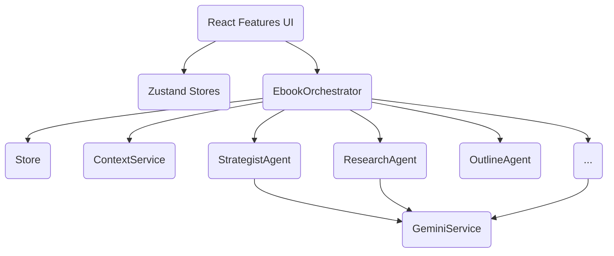
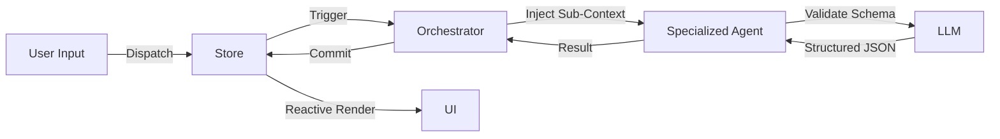
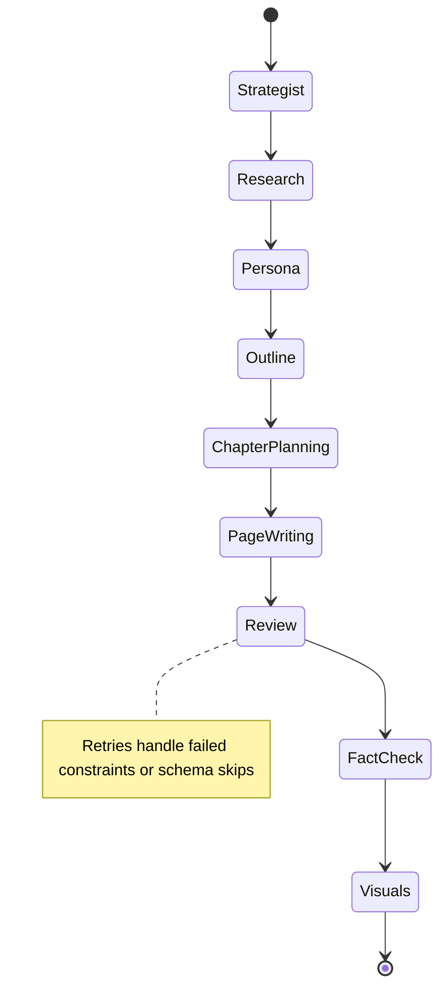
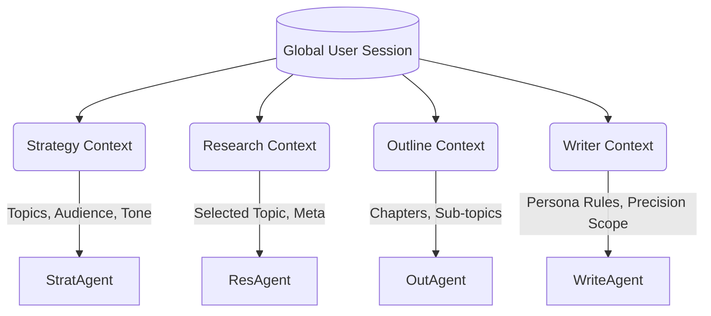

# E-Book AI SaaS Architecture Plan

## 1. New Folder Structure

```text
/app
 ├── agents/             # Independent AI agents (BaseAgent implementation)
 ├── components/         # Reusable structural UI, primitive components
 ├── features/           # Domain-specific components (eBook generator, editor, export)
 ├── hooks/              # Custom React hooks
 ├── orchestrators/      # Workflow coordination layers
 ├── prompts/            # Instruction and prompt management
 ├── repositories/       # Abstraction for data storage/fetching
 ├── services/           # External API & utility services (Gemini, Export)
 ├── stores/             # Centralized State Management (Zustand)
 ├── types/              # Type and Interface declarations
 ├── utils/              # Pure utility functions
 └── App.tsx             # Root Layout
```

## 2. Refactored Architecture

We move away from a monolithic React application directly calling LLMs. The new architecture is a **Feature-Driven Agentic System**:
- **Application State** is isolated into Zustand stores (`BookGenerationStore`, `UIStore`).
- **Core Domain Logic** is handled by modular AI Agents implementing a common `BaseAgent<TInput, TOutput>` interface. 
- **Orchestration** is handled by an `EbookOrchestrator` to coordinate execution, retry attempts, and failovers between agents.
- **Context Engineering**: Context is progressively managed and sliced via `ContextService` to respect LLM token windows and maximize inference precision.
- **UI Architecture**: UI becomes a dumb presentation layer reflecting store states and dispatching intent to Orchestrators. 

## 3. Migration Strategy

1. **Phase 1 (Data & Typing):** Define rigid schemas (`/types`) for all domains.
2. **Phase 2 (State Management):** Scaffold `BookGenerationStore` to cleanly divide Context, UI, and Generation state.
3. **Phase 3 (Core Services):** Implement the singleton API wrapper (`GeminiService`) and specialized `ContextService` for dynamic prompt enrichment.
4. **Phase 4 (Agent Implementation):** Roll out `BaseAgent` and all 10 specialized functional agents.
5. **Phase 5 (Orchestration):** Build `EbookOrchestrator` to pipeline agent outputs into the Store.
6. **Phase 6 (UI Componentization):** Deconstruct `App.tsx` into `/features` modules decoupled from direct logic.

## 4. Dependency Diagram



## 5. Data Flow Diagram



## 6. Agent Workflow Diagram



## 7. Context Flow Diagram


